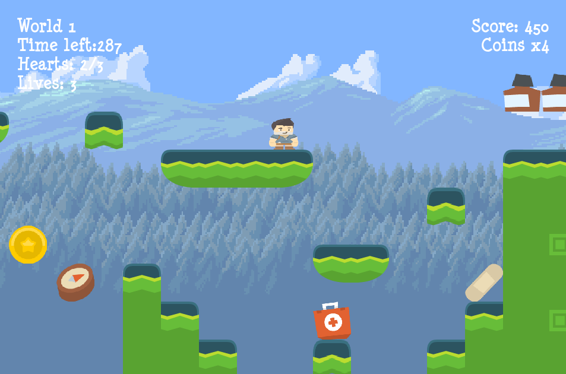

# Ethan's Pygame Platformer

## Downloads

-Repository:  https://emccau5902.github.io/platfomer/

-Zip: https://github.com/emccau5902/platfomer/archive/master.zip

-The Necessary version of Pygame needed to play this is 3.4.

### Instructions
-Controls: WASD for movement (The S key makes the hero crouch), Space to jump, and P to pause the game.

-The goal of the game is to finish the first level.

-There are 3 enemies; a monster, which moves back and forth on platforms, a bear which moves to and fro on the ground, and a bird-esque enemy that floats.

-The powerups that are included in the game are one ups, speed ups, hearts, and a power down of sorts: speed down.

-Besides the enemies, the main obstacle is navigating your way to the end of level by platforming. 

-There is also a chest which requires a key to open, and will award you with a powerup when opened.

### Screenshots

Start Screen 

Gameplay 

